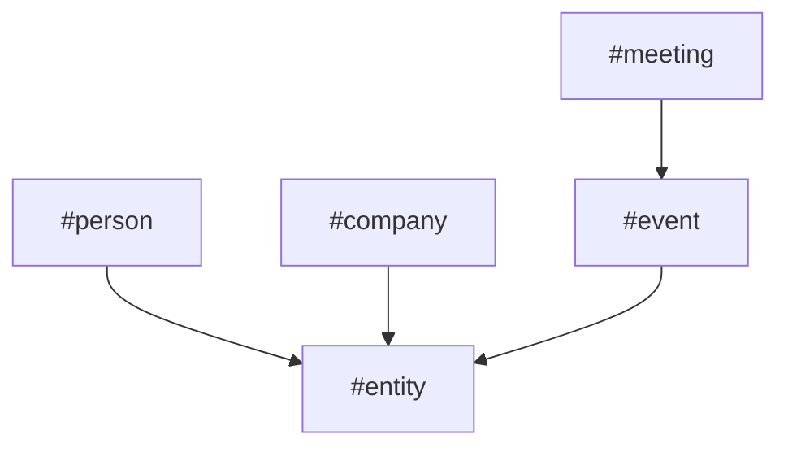
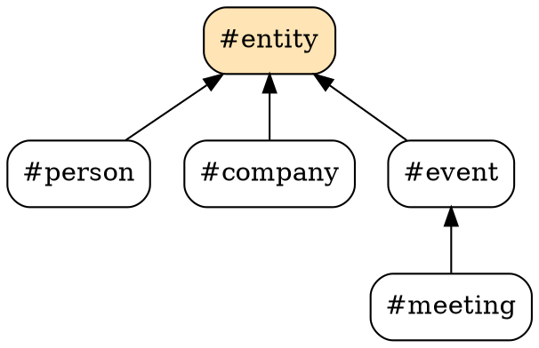
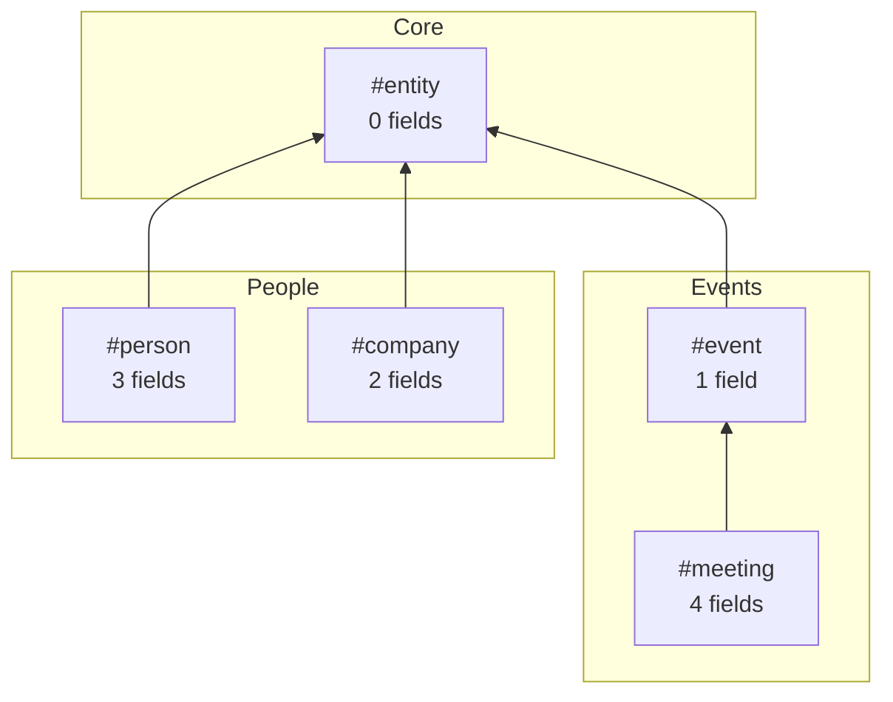
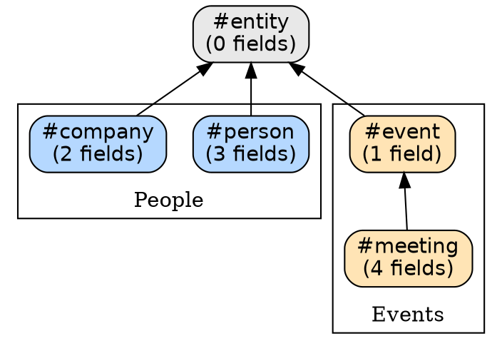

# Supertag Inheritance Visualization Specification

**Feature**: Graphical Overview of Supertag Inheritance Hierarchy
**Status**: Completed
**Created**: 2025-12-24
**Completed**: 2025-12-24

## Overview

This specification defines a visualization system for supertag inheritance chains, enabling users to understand tag relationships at a glance. The feature supports multiple output formats with varying implementation complexity.

## Problem Statement

Users managing large Tana workspaces with many supertags need to:
1. Understand the complete tag hierarchy at a glance
2. Identify inheritance relationships between tags
3. Find orphan tags (no parents) and terminal tags (no children)
4. Debug field inheritance issues (which tag provides which field?)
5. Share tag structure documentation with team members

Current `tags inheritance <tagname>` shows a single tag's ancestry, but provides no global view.

## Data Available

From the inheritance chain implementation:

| Data Source | Description |
|------------|-------------|
| `supertag_parents` table | Direct parent-child relationships |
| `supertag_metadata` table | Tag names, descriptions, colors |
| `supertag_fields` table | Fields per tag (own, not inherited) |
| `SupertagMetadataService` | Ancestors, descendants, full chains |

**Sample query** (recursive CTE for all relationships):
```sql
SELECT
  sm1.tag_name as child,
  sm2.tag_name as parent
FROM supertag_parents sp
JOIN supertag_metadata sm1 ON sp.child_tag_id = sm1.tag_id
JOIN supertag_metadata sm2 ON sp.parent_tag_id = sm2.tag_id
```

## Output Formats

### 1. Mermaid Diagrams

**Description**: Text-based diagram syntax rendered by many tools (GitHub, Obsidian, VS Code, etc.)

**Example Output**:


**Implementation Complexity**: Low

| Aspect | Effort | Notes |
|--------|--------|-------|
| Data gathering | Done | Existing `supertag_parents` table |
| Rendering | Trivial | String concatenation |
| Styling | Low | Mermaid supports colors, shapes |
| Dependencies | None | Pure text output |
| Testing | Low | String matching |

**Pros**:
- Zero dependencies
- Works in GitHub README, Obsidian, VS Code
- Version-controllable (text)
- Copy-paste friendly

**Cons**:
- Large graphs become unreadable (>50 nodes)
- No interactivity
- Layout algorithm not controllable

**CLI Command**:
```bash
supertag tags visualize --format mermaid > inheritance.md
supertag tags visualize --format mermaid --root entity  # Subtree only
supertag tags visualize --format mermaid --orphans      # Show disconnected tags
```

---

### 2. Graphviz DOT Format

**Description**: Industry-standard graph description language with powerful layout algorithms

**Example Output**:


**Implementation Complexity**: Low

| Aspect | Effort | Notes |
|--------|--------|-------|
| Data gathering | Done | Same as Mermaid |
| Rendering | Low | String templates |
| Styling | Medium | DOT syntax for colors, shapes |
| Dependencies | None (generation), Graphviz (viewing) | User needs `dot` CLI |
| Testing | Low | String matching |

**Pros**:
- Professional layout algorithms (hierarchical, circular, force-directed)
- Scales to 500+ nodes
- Export to SVG, PNG, PDF via `dot` command
- Widely used, good documentation

**Cons**:
- Requires Graphviz installation for rendering
- Not interactive
- Separate render step

**CLI Commands**:
```bash
supertag tags visualize --format dot > inheritance.dot
dot -Tsvg inheritance.dot > inheritance.svg
dot -Tpdf inheritance.dot > inheritance.pdf

# Convenience wrapper (requires graphviz):
supertag tags visualize --format svg > inheritance.svg
supertag tags visualize --format pdf > inheritance.pdf
```

---

### 3. PDF Export

**Description**: Static document with visual graph, suitable for documentation and sharing

**Two Approaches**:

#### 3a. Via Graphviz (Recommended)

Simply pipe DOT output through `dot -Tpdf`:
```bash
supertag tags visualize --format dot | dot -Tpdf > tags.pdf
```

**Implementation Complexity**: Low (if DOT format exists)

#### 3b. Native PDF Generation

Generate PDF directly using a library like `pdfkit` or Puppeteer.

**Implementation Complexity**: High

| Aspect | Effort | Notes |
|--------|--------|-------|
| Layout algorithm | High | Must implement graph layout |
| PDF generation | Medium | `pdfkit` or Puppeteer |
| Styling | Medium | Manual positioning |
| Dependencies | High | PDF library + layout solver |
| Testing | High | Visual regression testing |

**Recommendation**: Use Graphviz approach (3a). Native PDF adds significant complexity with little benefit.

---

### 4. Interactive HTML (Force-Directed Graph)

**Description**: Browser-based visualization with zoom, pan, and node interaction

**Tech Stack**: D3.js force-directed graph

**Example Output** (generated HTML file):
```html
<!DOCTYPE html>
<html>
<head>
  <script src="https://d3js.org/d3.v7.min.js"></script>
  <style>
    .node { fill: #69b3a2; stroke: #fff; stroke-width: 2px; }
    .node:hover { fill: #ff6b6b; }
    .link { stroke: #999; stroke-opacity: 0.6; }
    .label { font-family: sans-serif; font-size: 12px; }
  </style>
</head>
<body>
  <svg id="graph"></svg>
  <script>
    const data = {"nodes":[...],"links":[...]};
    // D3 force simulation code
  </script>
</body>
</html>
```

**Implementation Complexity**: Medium

| Aspect | Effort | Notes |
|--------|--------|-------|
| Data gathering | Done | JSON export of nodes/edges |
| Rendering | Medium | D3.js template (~100 lines) |
| Interactivity | Low | D3 handles zoom/pan/drag |
| Styling | Low | CSS |
| Dependencies | Low | D3.js via CDN |
| Testing | Medium | Puppeteer snapshot tests |

**Pros**:
- Interactive (zoom, pan, drag nodes)
- Works offline (single HTML file)
- Handles 100-300 nodes well
- No server required

**Cons**:
- Large graphs become cluttered (>300 nodes)
- No search/filter in basic version
- Layout not deterministic

**CLI Command**:
```bash
supertag tags visualize --format html > tags.html
open tags.html  # Opens in browser
```

---

### 5. 3D Browser Visualization

**Description**: Three-dimensional force-directed graph with WebGL rendering

**Tech Stack**: Three.js + 3d-force-graph library

**Example**:
```html
<!DOCTYPE html>
<html>
<head>
  <script src="https://unpkg.com/3d-force-graph"></script>
</head>
<body>
  <div id="graph"></div>
  <script>
    const data = {"nodes":[...],"links":[...]};
    ForceGraph3D()(document.getElementById('graph'))
      .graphData(data)
      .nodeLabel('name')
      .nodeColor(node => node.color)
      .linkDirectionalArrowLength(6)
      .linkDirectionalArrowRelPos(1);
  </script>
</body>
</html>
```

**Implementation Complexity**: Medium-High

| Aspect | Effort | Notes |
|--------|--------|-------|
| Data gathering | Done | Same JSON as 2D |
| Rendering | Medium | 3d-force-graph handles most work |
| Interactivity | Low | Built-in orbit controls |
| Styling | Medium | 3D materials, lighting |
| Dependencies | Medium | Three.js + 3d-force-graph |
| Testing | High | Visual testing, WebGL issues |
| Browser support | Medium | WebGL required |

**Pros**:
- Impressive visual impact
- Handles 500+ nodes (3D space)
- Orbit, zoom, pan built-in
- Can highlight paths, clusters

**Cons**:
- Learning curve for users
- May be overkill for simple hierarchies
- WebGL compatibility issues (older browsers)
- More complex to customize

**CLI Command**:
```bash
supertag tags visualize --format 3d > tags-3d.html
open tags-3d.html
```

---

### 6. Live Server Mode

**Description**: Local web server with real-time updates and filtering

**Implementation Complexity**: High

| Aspect | Effort | Notes |
|--------|--------|-------|
| Server | Medium | Bun.serve() with WebSocket |
| Frontend | High | React/Vue component |
| Real-time sync | Medium | Watch database for changes |
| Filtering/search | High | Client-side or server-side |
| Testing | High | Integration tests |

**CLI Command**:
```bash
supertag tags visualize --serve --port 8080
# Opens browser to http://localhost:8080
```

**Recommendation**: Defer to Phase 2. Static HTML export covers most use cases.

---

## Implementation Phases

### Phase 1: Core Formats (Low Effort)

| Format | Priority | Effort | Value |
|--------|----------|--------|-------|
| Mermaid | P0 | Low | High (GitHub/Obsidian) |
| DOT | P0 | Low | High (professional tools) |
| JSON | P0 | Trivial | High (custom tooling) |

**Deliverables**:
- `supertag tags visualize` command
- `--format mermaid|dot|json`
- `--root <tag>` for subtree visualization
- `--orphans` to show tags with no parents
- `--depth <n>` to limit traversal depth

### Phase 2: Interactive HTML (Medium Effort)

| Format | Priority | Effort | Value |
|--------|----------|--------|-------|
| HTML (2D) | P1 | Medium | High (interactive) |
| SVG | P1 | Low | Medium (via DOT) |
| PDF | P1 | Low | Medium (via DOT) |

**Deliverables**:
- `--format html` for interactive D3.js visualization
- `--format svg` (wraps `dot -Tsvg`)
- `--format pdf` (wraps `dot -Tpdf`)
- Node click shows tag details
- Zoom/pan controls

### Phase 3: 3D Visualization (Higher Effort)

| Format | Priority | Effort | Value |
|--------|----------|--------|-------|
| 3D HTML | P2 | Medium-High | Medium (impressive but niche) |

**Deliverables**:
- `--format 3d` for WebGL visualization
- Orbit controls
- Node highlighting
- Path tracing between tags

### Phase 4: Live Server (High Effort)

| Format | Priority | Effort | Value |
|--------|----------|--------|-------|
| Live server | P3 | High | Low (overkill for most users) |

**Deliverables**:
- `--serve` flag for live mode
- Real-time database sync
- Search/filter UI
- Tag detail panel

---

## CLI Design

```bash
# Basic usage
supertag tags visualize                      # Default: mermaid to stdout
supertag tags visualize --format dot         # Graphviz DOT format
supertag tags visualize --format json        # Raw node/edge data
supertag tags visualize --format html        # Interactive HTML file
supertag tags visualize --format 3d          # 3D WebGL visualization
supertag tags visualize --format svg         # SVG (requires graphviz)
supertag tags visualize --format pdf         # PDF (requires graphviz)

# Filtering options
supertag tags visualize --root entity        # Subtree from #entity
supertag tags visualize --orphans            # Include orphan tags
supertag tags visualize --depth 3            # Limit depth
supertag tags visualize --min-usage 10       # Only tags used 10+ times

# Output options
supertag tags visualize --output tags.html   # Write to file
supertag tags visualize --open               # Open result in browser
```

---

## Data Structures

### JSON Export Format

```typescript
interface VisualizationData {
  nodes: VisualizationNode[];
  links: VisualizationLink[];
  metadata: {
    totalTags: number;
    totalLinks: number;
    maxDepth: number;
    generatedAt: string;
  };
}

interface VisualizationNode {
  id: string;           // tagDef node ID
  name: string;         // Human-readable name (#meeting)
  fieldCount: number;   // Own fields only
  usageCount: number;   // How many nodes tagged
  color?: string;       // From Tana
  depth?: number;       // Distance from root (if filtering)
  isOrphan: boolean;    // No parents
  isLeaf: boolean;      // No children
}

interface VisualizationLink {
  source: string;       // Child tag ID
  target: string;       // Parent tag ID
}
```

---

## Implementation Files

| File | Purpose |
|------|---------|
| `src/commands/tags.ts` | Add `visualize` subcommand |
| `src/visualization/data.ts` | Gather visualization data from DB |
| `src/visualization/mermaid.ts` | Mermaid format generator |
| `src/visualization/dot.ts` | Graphviz DOT generator |
| `src/visualization/html.ts` | Interactive HTML template |
| `src/visualization/html-3d.ts` | 3D WebGL template |
| `tests/visualization/` | Test suite |

---

## Effort Summary

| Format | Implementation Effort | Dependencies | Value |
|--------|----------------------|--------------|-------|
| Mermaid | **Low** (2-4 hours) | None | High |
| DOT | **Low** (2-4 hours) | None (Graphviz for render) | High |
| JSON | **Trivial** (1 hour) | None | High |
| HTML 2D | **Medium** (8-12 hours) | D3.js (CDN) | High |
| SVG/PDF | **Trivial** (1 hour) | Graphviz | Medium |
| HTML 3D | **Medium-High** (12-16 hours) | Three.js (CDN) | Medium |
| Live server | **High** (20+ hours) | Many | Low |

**Recommended Start**: Mermaid + DOT + JSON (Phase 1) - covers 80% of use cases with <10 hours effort.

---

## Success Criteria

1. `supertag tags visualize` works with Mermaid, DOT, JSON formats
2. Output renders correctly in GitHub, Obsidian, VS Code
3. Graphs with 100+ tags remain readable
4. Orphan and leaf tags are identifiable
5. Filtering by root tag works
6. Interactive HTML (Phase 2) allows zoom/pan/click
7. Documentation includes examples

---

## Out of Scope

- Real-time collaboration
- Edit capabilities (visualization is read-only)
- Field-level visualization (focus on tag hierarchy)
- Cross-workspace visualization
- Mobile-optimized views

---

## Appendix: Sample Outputs

### Mermaid (Small Graph)



### Graphviz DOT (With Styling)



### JSON (For Custom Tooling)

```json
{
  "nodes": [
    {"id": "abc123", "name": "entity", "fieldCount": 0, "usageCount": 0, "isOrphan": true, "isLeaf": false},
    {"id": "def456", "name": "person", "fieldCount": 3, "usageCount": 804, "isOrphan": false, "isLeaf": true},
    {"id": "ghi789", "name": "meeting", "fieldCount": 4, "usageCount": 2245, "isOrphan": false, "isLeaf": true}
  ],
  "links": [
    {"source": "def456", "target": "abc123"},
    {"source": "ghi789", "target": "jkl012"}
  ],
  "metadata": {
    "totalTags": 576,
    "totalLinks": 89,
    "maxDepth": 4,
    "generatedAt": "2025-12-24T08:30:00Z"
  }
}
```
