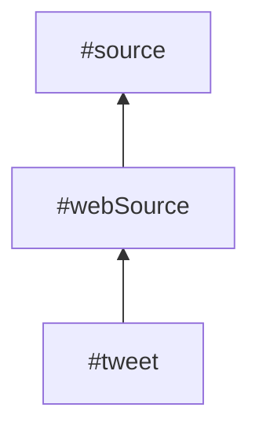
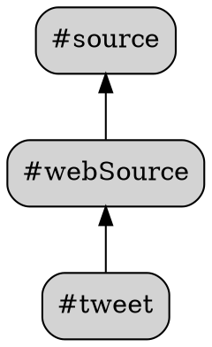

# Supertag Visualization

Generate visual representations of your supertag inheritance hierarchy. See how your tags relate to each other through parent-child relationships.

## Quick Start

```bash
# Generate Mermaid flowchart (default)
supertag tags visualize

# Output to file
supertag tags visualize --output graph.md
```

## Output Formats

### Mermaid (Default)

Mermaid flowcharts can be pasted directly into:
- Obsidian notes
- GitHub README/issues/PRs
- Notion
- Many markdown editors

```bash
supertag tags visualize
supertag tags visualize --format mermaid  # explicit
```

Example output:


### Graphviz DOT

DOT format for rendering with Graphviz to SVG, PNG, or PDF.

```bash
supertag tags visualize --format dot
supertag tags visualize --format dot --colors  # use tag colors
```

Example output:


### JSON

Raw data structure for custom tooling and analysis.

```bash
supertag tags visualize --format json
```

Returns:
```json
{
  "nodes": [
    {"id": "abc123", "name": "source", "fieldCount": 7, "usageCount": 100, "isOrphan": true, "isLeaf": false}
  ],
  "links": [
    {"source": "def456", "target": "abc123"}
  ],
  "metadata": {
    "totalTags": 150,
    "totalLinks": 272,
    "maxDepth": 4
  }
}
```

## Filtering Options

### Filter by Root Tag

Show only a subtree starting from a specific tag:

```bash
supertag tags visualize --root source
supertag tags visualize --root "web source"  # quoted if spaces
```

### Include Orphans

By default, tags with no inheritance relationships are excluded. Include them with:

```bash
supertag tags visualize --orphans
```

### Limit Depth

Limit how deep the inheritance tree goes:

```bash
supertag tags visualize --root source --depth 2
```

## Display Options

### Graph Direction

Control the flow direction of the graph:

| Direction | Description |
|-----------|-------------|
| `BT` | Bottom to Top (default) - children at bottom, parents at top |
| `TB` | Top to Bottom - parents at top, children below |
| `LR` | Left to Right - parents on left |
| `RL` | Right to Left - parents on right |

```bash
supertag tags visualize --direction TD
supertag tags visualize --format dot --direction LR
```

### Show Field Counts

Display how many fields each tag defines:

```bash
supertag tags visualize --show-fields
```

Output: `#meeting (5 fields)`

### Use Tag Colors (DOT only)

Apply Tana's tag colors to the graph nodes:

```bash
supertag tags visualize --format dot --colors
```

## Rendering to Images

### Using Mermaid CLI

Install and render Mermaid to PNG:

```bash
# Generate mermaid file
supertag tags visualize --root source > graph.mmd

# Render with mermaid-cli (auto-installs via npx)
npx @mermaid-js/mermaid-cli -i graph.mmd -o graph.png

# Options
npx @mermaid-js/mermaid-cli -i graph.mmd -o graph.png -b white -w 1200
npx @mermaid-js/mermaid-cli -i graph.mmd -o graph.svg  # SVG format
```

### Using Graphviz

Install Graphviz and render DOT files:

```bash
# Install Graphviz
brew install graphviz  # macOS
apt install graphviz   # Ubuntu/Debian

# Generate DOT file
supertag tags visualize --format dot --colors > graph.dot

# Render to various formats
dot -Tpng graph.dot -o graph.png
dot -Tsvg graph.dot -o graph.svg
dot -Tpdf graph.dot -o graph.pdf

# Different layout engines
neato -Tpng graph.dot -o graph.png  # spring model
fdp -Tpng graph.dot -o graph.png    # force-directed
```

### One-liner Examples

```bash
# Mermaid to PNG (one command)
supertag tags visualize --root source | npx @mermaid-js/mermaid-cli -i - -o source.png

# DOT to PNG (one command)
supertag tags visualize --format dot --colors | dot -Tpng -o tags.png

# Full graph to SVG
supertag tags visualize --format dot --show-fields | dot -Tsvg -o full-graph.svg
```

## Use Cases

### Understand Tag Structure

See how your supertags inherit from each other:

```bash
supertag tags visualize --root entity --show-fields --direction TD
```

### Document Your Schema

Generate documentation for your Tana setup:

```bash
supertag tags visualize --format dot --colors --show-fields > schema.dot
dot -Tpdf schema.dot -o "Tana Schema.pdf"
```

### Find Orphan Tags

Identify tags that aren't part of any inheritance hierarchy:

```bash
supertag tags visualize --orphans --format json | jq '.nodes[] | select(.isOrphan) | .name'
```

### Analyze Complexity

Get statistics about your tag hierarchy:

```bash
supertag tags visualize --format json | jq '.metadata'
```

## Troubleshooting

### Graph Too Large

If the full graph is overwhelming:

```bash
# Focus on a specific subtree
supertag tags visualize --root source

# Or use JSON to analyze programmatically
supertag tags visualize --format json | jq '.nodes | length'
```

### Mermaid CLI Not Found

Install via npx (auto-downloads):

```bash
npx @mermaid-js/mermaid-cli -i graph.mmd -o graph.png
```

Or install globally:

```bash
npm install -g @mermaid-js/mermaid-cli
mmdc -i graph.mmd -o graph.png
```

### Graphviz Not Installed

```bash
# macOS
brew install graphviz

# Ubuntu/Debian
sudo apt install graphviz

# Verify
dot -V
```

### Special Characters in Tag Names

Tag names with special characters are automatically escaped in both Mermaid and DOT output. If you encounter issues, use the JSON format and process with custom tooling.

## Command Reference

```
supertag tags visualize [options]

Options:
  --format <format>    Output format: mermaid, dot, json (default: mermaid)
  --root <tag>         Filter to subtree from this tag
  --depth <n>          Maximum depth to traverse
  --orphans            Include orphan tags (no parents or children)
  --direction <dir>    Graph direction: BT, TB, LR, RL (default: BT)
  --show-fields        Show field counts in node labels
  --colors             Use tag colors (DOT format only)
  --output <file>      Write to file instead of stdout
  --json               Output as JSON (same as --format json)
  -w, --workspace      Workspace alias
```
